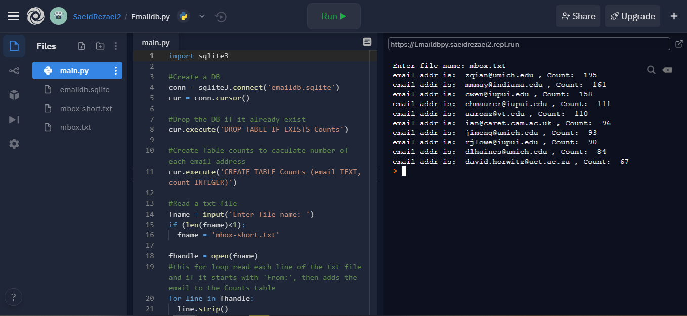
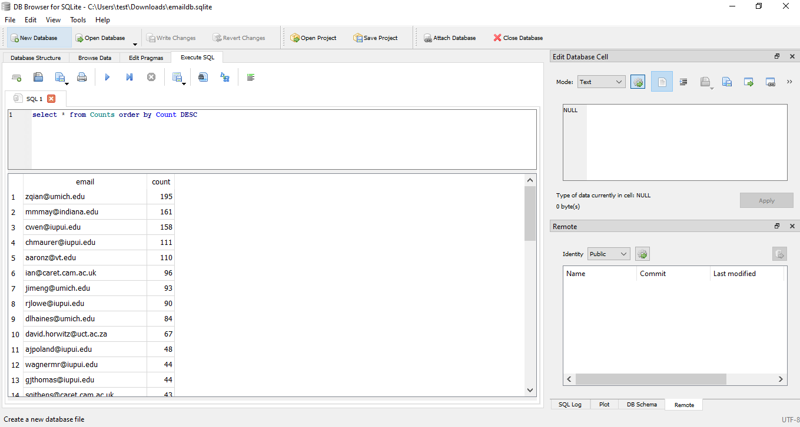

# Emaildb.py
This application will read a tat file containing some organizational emails and count up the number email message.  The result will save in a DataBase callede maildb.sqlite using the sqlite3 library.
Below you can see pictures of the resultss for the mbox.txt file.
 

 
  

   

 
  

