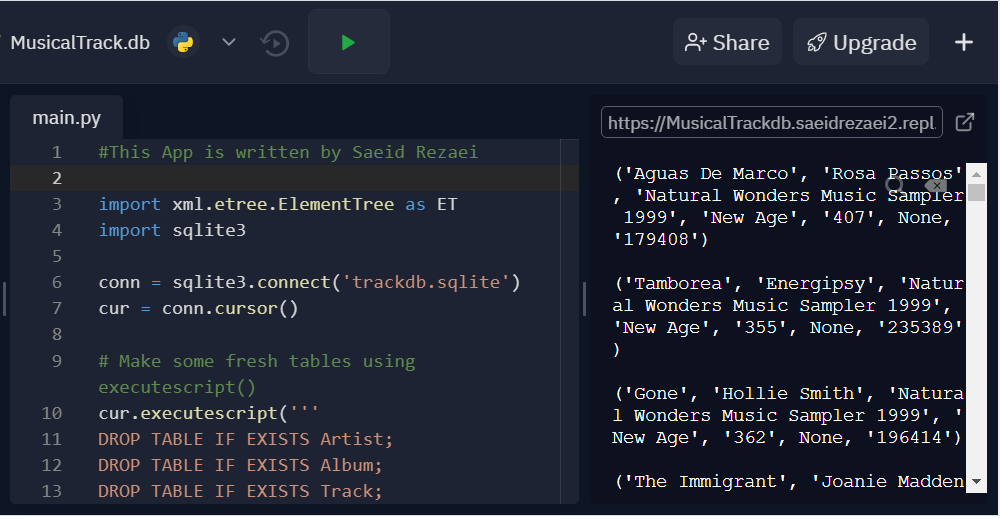
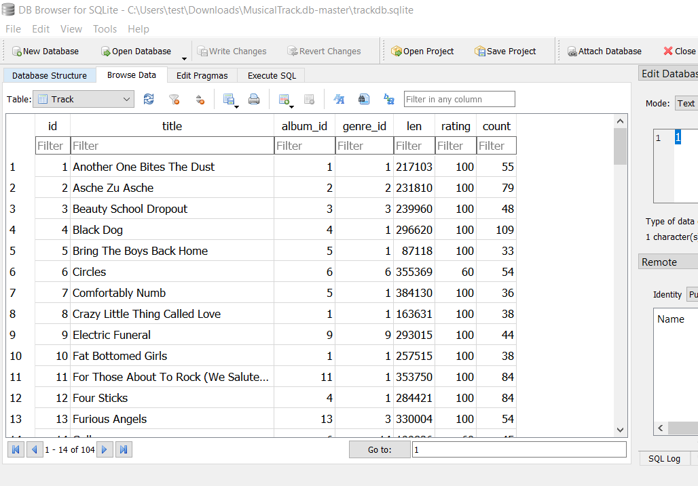
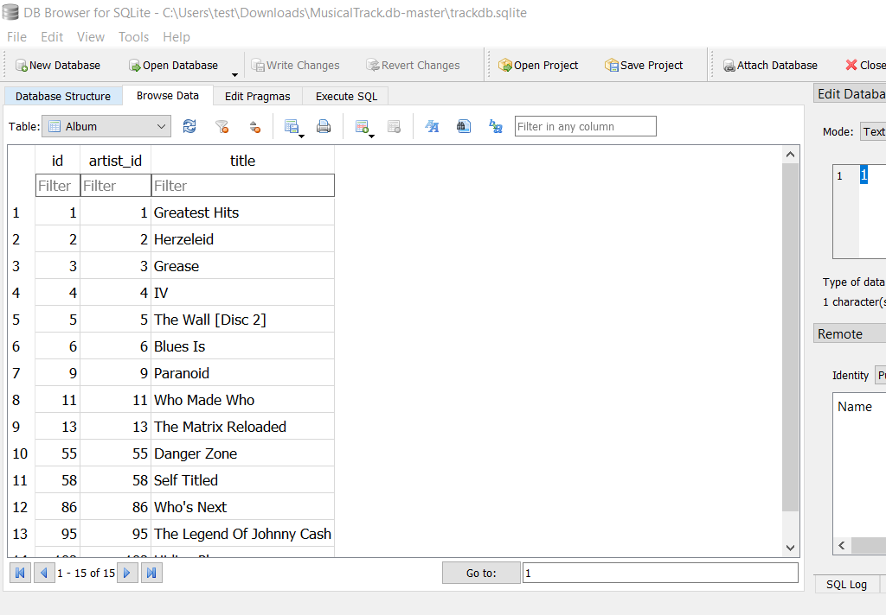

This application will read an iTunes export file in XML and produce a properly normalized database with four tables. Below you can see pictures of the results for the [Library.xml](Library.xml) file. This file contains information about different tracks. 
 

 
  

   

 
  

 
  

   

 
  

 
  

   

 
  

