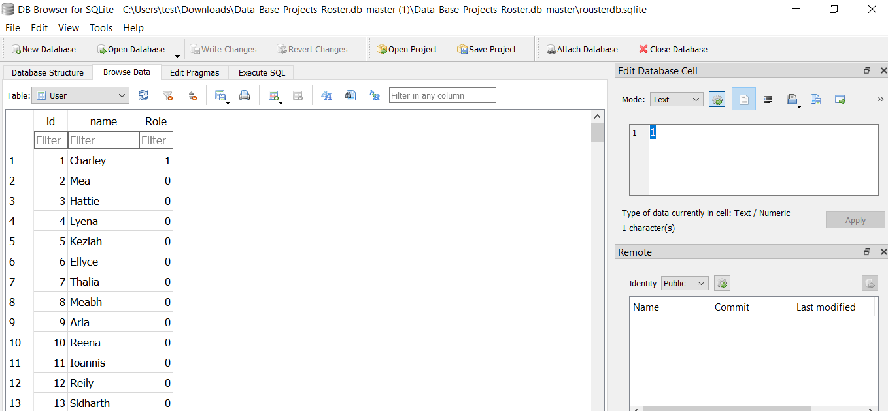

this is an training project written by me to create a data base with three tables using Sqlite and store the extracted data of a jason file. The [json file](roster_data_sample.json) contain the information related to Users, Their roles (Student=0, Teacher=1) and Courses.
The project is written in Python and the result is as following.

 
  

   

 
  

 

 
  

